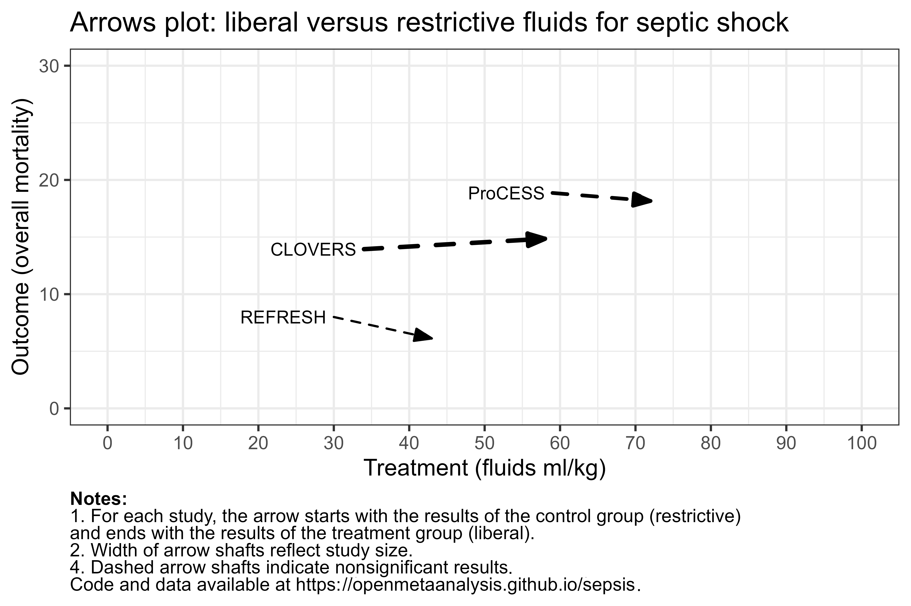

# Septic shock treatment - fluid volumes
A living systematic review

Short url: http://openmetaanalysis.github.io/sepsis

**Clinical summary:** This meta-analysis suggests that early fluid dosing <20 mL/kg is associated with increased mortality risk  '[might not be important](http://handbook-5-1.cochrane.org/chapter_9/9_5_2_identifying_and_measuring_heterogeneity.htm)' at NA%. This review complements are prior review on timing of initial fluids (Ward et al, 2022 PMID: [35946105](http://pubmed.gov/35946105))

<!--
* [Reconciliation of conclusions with prior meta-analyses](files/reconciliation-tables/Reconciliation%20of%20conclusions.pdf) (under construction)
* [Keep current with this topic](files/searching/Keep-up.md) (under construction)

**Methods overview:** This repository is an [openMetaAnalysis](https://openmetaanalysis.github.io/) that combines methods of scoping, rapid, and living systematic reviews.  This analysis updates one or more previously published review(s) below. A comparison of studies included in this review compared to prior reviews are in the table, [reconciliation of trials included with prior meta-analyses/](files/reconciliation-tables/Reconciliation%20of%20studies.pdf). Newer studies included are listed in the references below. Rationale for newer trials excluded may be listed at the end of the references. 
* [Methods](http://openmetaanalysis.github.io/methods.html) for openMetaAnalysis
* [Evidence search](files/searching/evidence-search.md) for this review (under construction)

**Results:** Details of the studies included are in the:
* [Description of studies (PICO table)](files/study-details/pico-table.md) (under construction)
* [Risk of bias assessment](files//study-details/risk-of-bias.md) (under construction)
* [Forest plots](files//forest-plots) ([source data](files/data))
* [Meta-regressions](files//metaregression) ([source data](files/data))
* [Reconciliation of conclusions and trials included with prior meta-analyses](files/reconcilation-tables) (under construction)
-->
The forest plot for the primary outcomes are below. Additional [forest plots](files/forest-plots) of secondary analyses may be available. 

The arrows plot for the primary outcomes are below. Additional [arrows-plots](files/arrows-plots) of secondary analyses may be available. 

<!--
The meta-regression for the primary outcomes are below. Additional [meta-regressions](files/metaregression) of secondary analyses may be available. 

-->
References:
----------------------------------
### Systematic review(s)
#### Most recent review(s) at time of last revision of this repository
1. Pepper DJ, Jaswal D, Sun J, Welsh J, Natanson C, Eichacker PQ. Evidence Underpinning the Centers for Medicare & Medicaid Services' Severe Sepsis and Septic Shock Management Bundle (SEP-1): A Systematic Review. Ann Intern Med. 2018 Apr 17;168(8):558-568. doi: 10.7326/M17-2947. Epub 2018 Feb 20. Erratum in: Ann Intern Med. 2018 Apr 17;168(8):612. doi: 10.7326/L18-0132. PMID: [29459977](http://pubmed.gov/29459977); PMCID: PMC11146290.
2. Meyhoff TS, Møller MH, Hjortrup PB, Cronhjort M, Perner A, Wetterslev J. Lower vs Higher Fluid Volumes During Initial Management of Sepsis: A Systematic Review With Meta-Analysis and Trial Sequential Analysis. Chest. 2020 Jun;157(6):1478-1496. doi: 10.1016/j.chest.2019.11.050. Epub 2020 Jan 23. PMID: [31982391](http://pubmed.gov/31982391).
3. Reynolds PM, Wells L, MacLaren R, Scoular SK. Establishing the Therapeutic Index of Fluid Resuscitation in the Septic Patient: A Narrative Review and Meta-Analysis. Pharmacotherapy. 2020 Mar;40(3):256-269. doi: 10.1002/phar.2371. Epub 2020 Feb 18. PMID: [31970818](http://pubmed.gov/31970818).
4. Xantus GZ, Allen P, Norman S, Kanizsai PL. Mortality benefit of crystalloids administered in 1-6 hours in septic adults in the ED: systematic review with narrative synthesis. Emerg Med J. 2021 Jun;38(6):430-438. doi: 10.1136/emermed-2020-210298. Epub 2021 Apr 15. PMID: [33858861](http://pubmed.gov/33858861).
5. Ward MA, Kuttab HI, Tuck N, Taleb A, Okut H, Badgett RG. The Effect of Fluid Initiation Timing on Sepsis Mortality: A Meta-Analysis. J Intensive Care Med. 2022 Nov;37(11):1504-1511. doi: 10.1177/08850666221118513. Epub 2022 Aug 9. PMID: [35946105](http://pubmed.gov/35946105).

### Randomized controlled trials included
1. ProCESS Investigators; Yealy DM, Kellum JA, Huang DT, Barnato AE, Weissfeld LA, Pike F, Terndrup T, Wang HE, Hou PC, LoVecchio F, Filbin MR, Shapiro NI, Angus DC. A randomized trial of protocol-based care for early septic shock. N Engl J Med. 2014 May 1;370(18):1683-93. doi: 10.1056/NEJMoa1401602. Epub 2014 Mar 18. PMID: [24635773](http://pubmed.gov/24635773); PMCID: PMC4101700.
2. Macdonald SPJ, Keijzers G, Taylor DM, Kinnear F, Arendts G, Fatovich DM, Bellomo R, McCutcheon D, Fraser JF, Ascencio-Lane JC, Burrows S, Litton E, Harley A, Anstey M, Mukherjee A; REFRESH trial investigators. Restricted fluid resuscitation in suspected sepsis associated hypotension (REFRESH): a pilot randomised controlled trial. Intensive Care Med. 2018 Dec;44(12):2070-2078. doi: 10.1007/s00134-018-5433-0. Epub 2018 Oct 31. PMID: [30382308](http://pubmed.gov/30382308).
3. National Heart, Lung, and Blood Institute Prevention and Early Treatment of Acute Lung Injury Clinical Trials Network; Shapiro NI, Douglas IS, Brower RG, Brown SM, Exline MC, Ginde AA, Gong MN, Grissom CK, Hayden D, Hough CL, Huang W, Iwashyna TJ, Jones AE, Khan A, Lai P, Liu KD, Miller CD, Oldmixon K, Park PK, Rice TW, Ringwood N, Semler MW, Steingrub JS, Talmor D, Thompson BT, Yealy DM, Self WH. Early Restrictive or Liberal Fluid Management for Sepsis-Induced Hypotension. N Engl J Med. 2023 Feb 9;388(6):499-510. doi: 10.1056/NEJMoa2212663. Epub 2023 Jan 21. PMID: [36688507](http://pubmed.gov/36688507); PMCID: PMC10685906.

#### New study(s) undergoing review
None

#### New study(s) *excluded* 
None

-------------------------------
[Cite and use this content](https://github.com/openMetaAnalysis/openMetaAnalysis.github.io/blob/master/reusing.MD)  - [Edit this page](../../edit/master/README.md) - [History](../../commits/master/README.md)  - 
[Issues and comments](../../issues?q=is%3Aboth+is%3Aissue)

