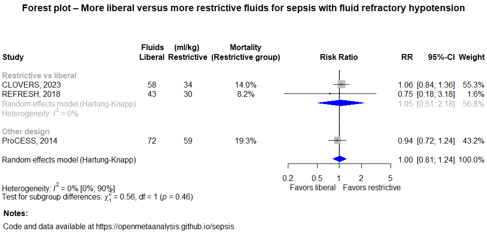

# Sepsis treatment and fluid type

A living systematic review

Short url: http://openmetaanalysis.github.io/sepsis-fluid-type

**Clinical summary:** This meta-analysis suggests that balanced Crystalloids reduce mortality. The heterogenteity as measured by I2 was '[might not be important](http://handbook-5-1.cochrane.org/chapter_9/9_5_2_identifying_and_measuring_heterogeneity.htm)' at 0%.

* [Reconciliation of conclusions with prior meta-analyses](files/reconciliation-tables/Reconciliation%20of%20conclusions.pdf) (under construction)
* [Keep current with this topic](files/searching/Keep-up.md) (under construction)

**Methods overview:** This repository is an [openMetaAnalysis](https://openmetaanalysis.github.io/) that combines methods of scoping, rapid, and living systematic reviews.  This analysis updates one or more previously published review(s) below. A comparison of studies included in this review compared to prior reviews are in the table, [reconciliation of trials included with prior meta-analyses/](files/reconciliation-tables/Reconciliation%20of%20studies.pdf). Newer studies included are listed in the references below. Rationale for newer trials excluded may be listed at the end of the references. 
* [Methods](http://openmetaanalysis.github.io/methods.html) for openMetaAnalysis
* [Evidence search](files/searching/evidence-search.md) for this review (under construction)

**Results:** Details of the studies included are in the:
* [Description of studies (PICO table)](files/study-details/pico-table.md) (under construction)
* [Risk of bias assessment](files//study-details/risk-of-bias.md) (under construction)
* [Forest plots](files//forest-plots) ([source data](files/data))
* [Meta-regressions](files//metaregression) ([source data](files/data))
* [Reconciliation of conclusions and trials included with prior meta-analyses](files/reconcilation-tables) (under construction)

The forest plot for the primary outcomes are below. Additional [forest plots](files/forest-plots) of secondary analyses may be available. 

The meta-regression for the primary outcomes are below. Additional [meta-regressions](files/metaregression) of secondary analyses may be available. 

References:
----------------------------------
### Systematic review(s)
#### Most recent review(s) at time of last revision of this repository
1. 

### Randomized controlled trials that are more recent

### Randomized controlled trials included
1. Self WH, Semler MW, Wanderer JP, Wang L, Byrne DW, Collins SP, Slovis CM, Lindsell CJ, Ehrenfeld JM, Siew ED, Shaw AD, Bernard GR, Rice TW; SALT-ED Investigators. Balanced Crystalloids versus Saline in Noncritically Ill Adults. N Engl J Med. 2018 Mar 1;378(9):819-828. doi: 10.1056/NEJMoa1711586. Epub 2018 Feb  27. PubMed PMID: [29485926](http://pubmed.gov/29485926)
2. Semler MW, Self WH, Wanderer JP, Ehrenfeld JM, Wang L, Byrne DW, Stollings JL, Kumar AB, Hughes CG, Hernandez A, Guillamondegui OD, May AK, Weavind L, Casey JD, Siew ED, Shaw AD, Bernard GR, Rice TW; SMART Investigators and the Pragmatic Critical Care Research Group. Balanced Crystalloids versus Saline in Critically Ill Adults. N Engl J Med. 2018 Mar 1;378(9):829-839. doi: 10.1056/NEJMoa1711584. Epub 2018 Feb 27. PubMed PMID: [29485925](http://pubmed.gov/29485925)
3. Semler MW, Wanderer JP, Ehrenfeld JM, Stollings JL, Self WH, Siew ED, Wang L,  Byrne DW, Shaw AD, Bernard GR, Rice TW; SALT Investigators * and the Pragmatic Critical Care Research Group; SALT Investigators. Balanced Crystalloids versus Saline in the Intensive Care Unit. The SALT Randomized Trial. Am J Respir Crit Care Med. 2017 May 15;195(10):1362-1372. doi: 10.1164/rccm.201607-1345OC. PubMed PMID: [27749094](http://pubmed.gov/27749094)
4. Verma B, Luethi N, Cioccari L, Lloyd-Donald P, Crisman M, Eastwood G, Orford N, French C, Bellomo R, Martensson J. A multicentre randomised controlled pilot study of fluid resuscitation with saline or Plasma-Lyte 148 in critically ill patients. Crit Care Resusc. 2016 Sep;18(3):205-12. PubMed PMID: [27604335](http://pubmed.gov/27604335)
5. Young P, Bailey M, Beasley R, Henderson S, Mackle D, McArthur C, McGuinness S, Mehrtens J, Myburgh J, Psirides A, Reddy S, Bellomo R; SPLIT Investigators; ANZICS CTG. Effect of a Buffered Crystalloid Solution vs Saline on Acute Kidney Injury Among Patients in the Intensive Care Unit: The SPLIT Randomized Clinical Trial. JAMA. 2015 Oct 27;314(16):1701-10. doi: 10.1001/jama.2015.12334. Erratum
in: JAMA. 2015 Dec 15;314(23):2570. PubMed PMID: [26444692](http://pubmed.gov/26444692)

#### New study(s) undergoing review
1. Self WH, Semler MW, Wanderer JP, Wang L, Byrne DW, Collins SP, Slovis CM, Lindsell CJ, Ehrenfeld JM, Siew ED, Shaw AD, Bernard GR, Rice TW; SALT-ED Investigators. Balanced Crystalloids versus Saline in Noncritically Ill Adults. N Engl J Med. 2018 Mar 1;378(9):819-828. doi: 10.1056/NEJMoa1711586. Epub 2018 Feb  27. PMID: [29485926](http://pubmed.gov/29485926)
2. Semler MW, Self WH, Wanderer JP, Ehrenfeld JM, Wang L, Byrne DW, Stollings JL, Kumar AB, Hughes CG, Hernandez A, Guillamondegui OD, May AK, Weavind L, Casey JD, Siew ED, Shaw AD, Bernard GR, Rice TW; SMART Investigators and the Pragmatic Critical Care Research Group. Balanced Crystalloids versus Saline in Critically Ill Adults. N Engl J Med. 2018 Mar 1;378(9):829-839. doi: 10.1056/NEJMoa1711584.  Epub 2018 Feb 27. PMID: [29485925](http://pubmed.gov/29485925)

#### New study(s) *excluded* 
None

-------------------------------
[Cite and use this content](https://github.com/openMetaAnalysis/openMetaAnalysis.github.io/blob/master/reusing.MD)  - [Edit this page](../../edit/master/README.md) - [History](../../commits/master/README.md)  - 
[Issues and comments](../../issues?q=is%3Aboth+is%3Aissue)

